# 🛒 Supermarket Sales Analysis & ETL Pipeline


---

## 📌 Executive Summary

This project performs end-to-end **Data Profiling, Cleaning, Transformation, and Business Intelligence Analysis** on a supermarket transactional dataset. 

Using **Python and Pandas**, raw transactional logs were processed through a structured pipeline to fix structural anomalies, impute missing values, construct key temporal/satisfaction dimensions, and extract high-value commercial insights.

* **Primary Dataset:** [`SuperMarket.csv`](SuperMarket.csv)
* **Dataset Scope:** 1,014 Initial Transactions across Multiple Branch Outlets
* **Target Output:** Standardized Analytics Dataset & Executive Visualizations

---

## 🛠️ Tech Stack & Libraries

* **Core Language:** `Python 3.x`
* **Data Manipulation & Processing:** `Pandas`, `NumPy`
* **Visualization:** `Matplotlib`, `Seaborn`
* **Documentation & Reporting:** `Markdown`, `ReportLab`

---

## 🧹 Data Pipeline & Preprocessing Workflow

Before conducting business analysis, the raw dataset underwent comprehensive cleaning and validation steps:

1. **Schema Audit & Type Casting:** Converted string-based `Sales` and `Date` variables into native `float64` and `datetime64` types.
2. **Missing Value Imputation:** Identified and resolved null records across `Unit price`, `Sales`, and `Date`.
3. **Deduplication:** Dropped 14 full duplicate transaction records to enforce entity integrity.
4. **Header Normalization:** Stripped leading/trailing whitespace noise from column titles (e.g., `' Customer type'`, `' cogs'`).
5. **Feature Engineering:**
   * **Temporal Extraction:** Extracted `Day`, `Month`, and `Year` fields from target dates.
   * **Customer Satisfaction:** Derived binary target `Satisfied` based on the rule:
     $$\text{Satisfied} = \begin{cases} \text{'Satisfied'}, & \text{Rating} \ge 7 \\ \text{'Not Satisfied'}, & \text{Rating} < 7 \end{cases}$$

---

## 📊 Key Business Insights & Analytics Findings

<div align="center">

| Metric | Business Value | Key Finding |
| :--- | :--- | :--- |
| **Total Revenue** | **324,382 EGP** | Total cumulative revenue across all valid transactions |
| **Top Performing City** | **Naypyitaw** | Highest revenue-generating city |
| **Top Performing Branch** | **Giza** | Branch leading in net sales volume |
| **Best Product Category** | **Food and beverages** | Highest revenue driver among product lines |
| **Primary Payment Method** | **E-wallet** | Preferred checkout payment method |
| **Average Order Value** | **319.90 EGP** | Mean spend per basket/transaction |
| **Customer Satisfaction** | **49.8%** | Ratio of customers rating $\ge 7$ |

</div>

---

### 📈 Visual Analysis Breakdown

#### 1. Total Revenue Performance
The overall dataset generated a total business revenue of **324,382 EGP**.

<div align="center">
  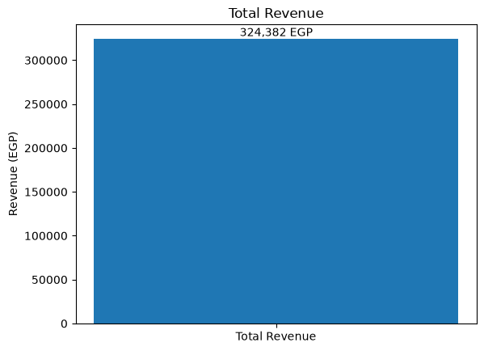
</div>

---

#### 2. Revenue Distribution by City
**Highest Revenue City:** `Naypyitaw`

<div align="center">
  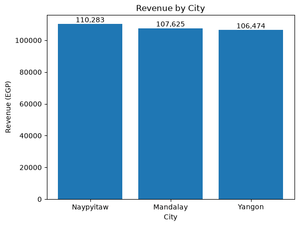
</div>

---

#### 3. Profitability Analysis by Branch
**Most Profitable Branch:** `Giza`

<div align="center">
  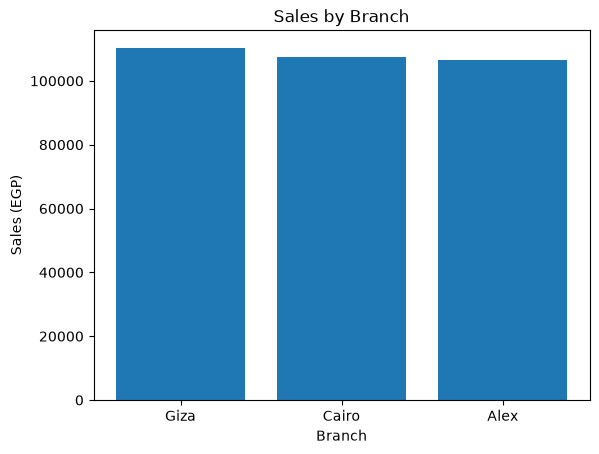
</div>

---

#### 4. Revenue & Profit by Product Category
**Top-Performing Category:** `Food and beverages`

<div align="center">
  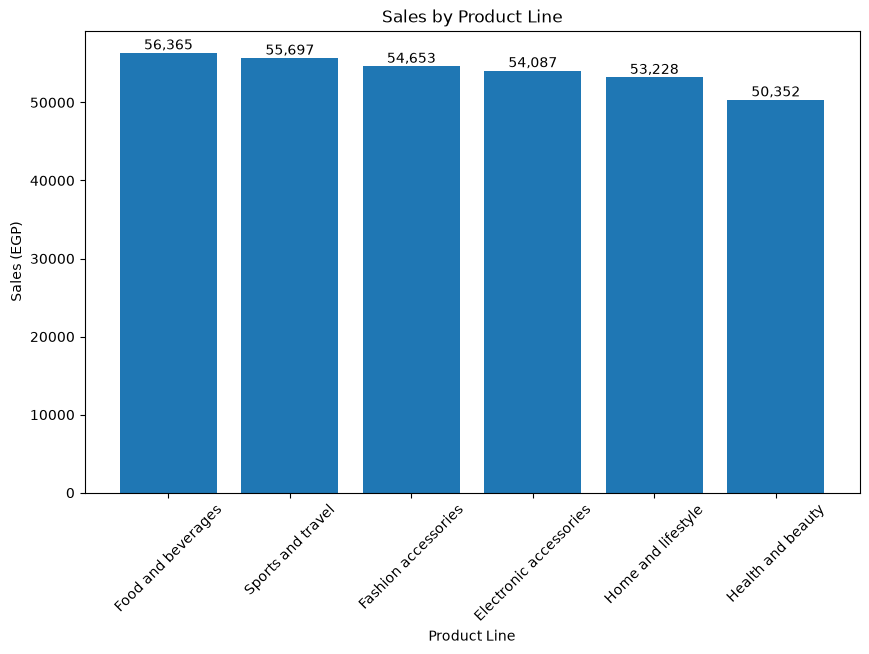
</div>

---

#### 5. Spending Dynamics by Customer Type
**Highest Spending Segment:** `Member`

<div align="center">
  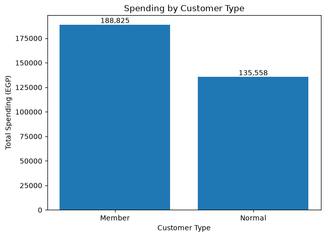
</div>

---

#### 6. Payment Method Preferences
**Most Popular Method:** `E-wallet`

<div align="center">
  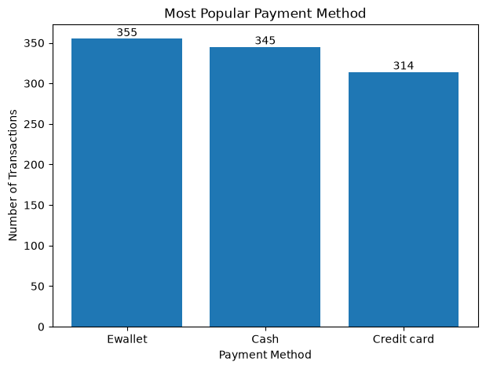
</div>

---

#### 7. Basket Analysis (Average Transaction Value)
**Average Basket Value:** `319.90 EGP`

<div align="center">
  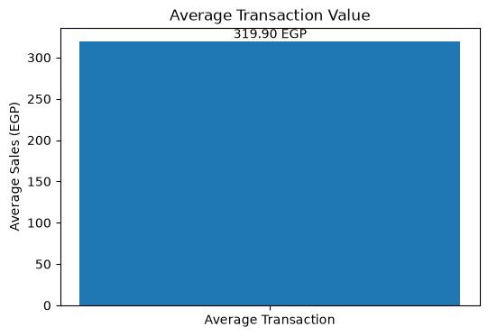
</div>

---

#### 8. Satisfaction Index by Branch
**Branch with Highest Satisfaction:** `Alex`

<div align="center">
  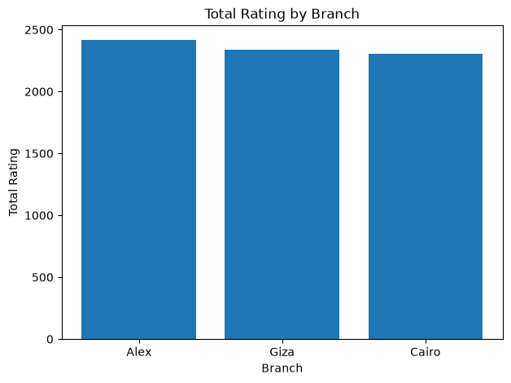
</div>

---

#### 9. Temporal Trends (Sales by Day & Month)
* **Peak Sales Day:** Day `15`
* **Peak Sales Month:** Month `1` (January)

<div align="center">
  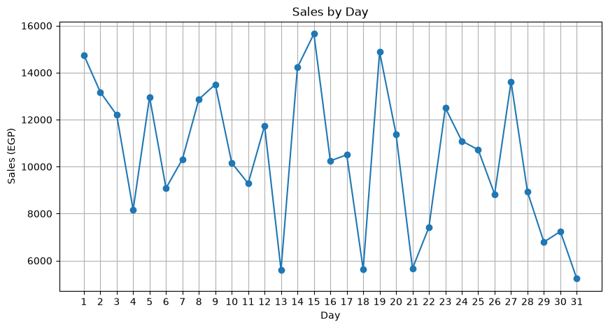
  <br><br>
  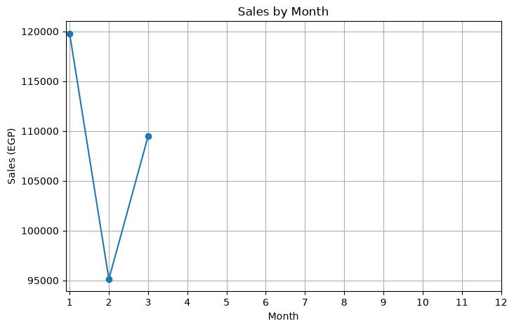
</div>

---

#### 10. Overall Customer Satisfaction Benchmark
**Satisfaction Rate:** `49.8%`

<div align="center">
  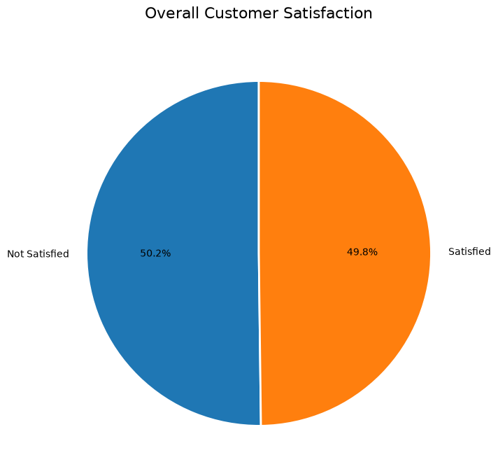
</div>

---

## 📂 Project Structure

```bash
├── SuperMarket.csv          # Raw Dataset
├── Supermarket_Analysis.ipynb # Core Jupyter Notebook (Pandas & Data Processing)
├── Data_Profiling_Report.pdf # Generated PDF Data Profiling Report
├── README.md                # Project Documentation & Executive Summary
└── images/                  # Exported High-Res Charts & Figures
    ├── Total_Revenue.png
    ├── Revenue_by_City.png
    ├── Profit_by_Branch.png
    ├── Revenue_and_Profit_by_Product_Category.png
    ├── Spending_by_Customer_Type.png
    ├── Payment_Method.png
    ├── Average_Transaction_Value.png
    ├── Customer_Satisfaction_by_Branch.png
    ├── Sales_by_Day.png
    ├── Sales_by_Month.png
    └── Overall_Customer_Satisfaction.png
